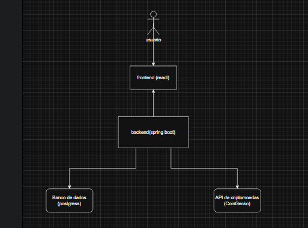

# 📊 CoinEdu
Sistema educacional para aprendizado simplificado sobre criptomoedas, voltado para iniciantes e idosos com baixa familiaridade digital. 

## 1. Contexto do Problema
Pessoas com pouca ou nenhuma experiência no mercado de criptomoedas, especialmente iniciantes e idosos, enfrentam dificuldades para compreender como esse tipo de investimento funciona.

### 👥 Quem são as pessoas?

- Iniciantes no mercado cripto

- Idosos com baixa familiaridade digital

- Usuários com pouco conhecimento financeiro

### ⚠ Dor concreta

- Medo de perder dinheiro

- Dificuldade em entender termos técnicos

- Dificuldade para interpretar gráficos

- Insegurança diante da alta volatilidade

### 📵 Restrições do ambiente

- Dispositivos móveis básicos

- Acesso limitado à internet

- Baixa alfabetização digital

## 2. Objetivo do Produto
Criar um produto digital que permita o acompanhamento e o aprendizado simplificado sobre o mercado de criptomoedas para iniciantes e idosos, mesmo diante de limitações tecnológicas, promovendo segurança, compreensão do mercado e inclusão financeira.

## 3. Restrições e Premissas

O sistema:

- ❌ Não permitirá compra ou venda com dinheiro real

- ❌ Não oferecerá recomendações personalizadas de investimento

- ❌ Não garantirá lucros ou resultados futuros

- ❌ Não substituirá plataformas reais de negociação

- ❌ Não terá integração com bancos

## 4. Governança do Produto

- Consulta: Qualquer usuário

- Cadastro/Edição: Administrador do sistema

- Curadoria/Validação: Administrador ou técnico responsável

## 5. Atores

### Atores Primários
- Usuários iniciantes
- Usuários idosos

### Atores Secundários
- Administradores do sistema

### Sistemas Externos

- API de dados de criptomoedas (ex: CoinGecko)

- Banco de dados

## 6. Casos de Uso

### UC01 – Consultar Informações de Criptomoeda
**Ator primário:** Usuário
**Objetivo:** Visualizar informações simplificadas sobre uma criptomoeda

#### Pré-condições
- Usuário com acesso ao sistema
- Conexão disponível

#### Cenário Principal
1. Usuário acessa a lista de criptomoedas

2. Seleciona uma moeda

3. Sistema exibe:

- O que é

- Para que serve

- Nível de volatilidade

- Nível de risco

4. Usuário visualiza as informações

### Extensões
- Falha na API → Sistema exibe mensagem de indisponibilidade temporária.
- Dados incompletos → Sistema exibe aviso de informações limitadas.

---

### UC02 – Adicionar Moeda aos Favoritos

**Ator primário:** Usuário  
**Objetivo:** Permitir que o usuário marque uma criptomoeda como favorita.

#### Pré-condições
- Usuário autenticado no sistema.

#### Cenário Principal
1. Usuário acessa a página da moeda desejada.
2. Clica no botão “Adicionar aos Favoritos”.
3. Sistema registra a moeda na lista pessoal do usuário.
4. Sistema confirma a ação com mensagem de sucesso.

#### Extensões
- Moeda já favoritada → Sistema informa que a moeda já está na lista.
- Usuário não autenticado → Sistema solicita login.

---

### UC03 – Visualizar Comparação de Preço

**Ator primário:** Usuário  
**Objetivo:** Permitir que o usuário visualize a variação de preço em períodos anteriores.

#### Pré-condições
- Moeda selecionada.
- Dados disponíveis na API.

#### Cenário Principal
1. Usuário acessa a página da moeda.
2. Sistema exibe gráfico simplificado.
3. Usuário seleciona opção “Ver 3 dias atrás” ou “Ver 5 dias atrás”.
4. Sistema atualiza o gráfico com comparação de valores.

#### Extensões
- Dados indisponíveis → Sistema informa erro temporário.
- Falha na conexão → Sistema sugere tentar novamente.

---

### UC04 – Utilizar Simulador Educacional de Valor

**Ator primário:** Usuário  
**Objetivo:** Permitir que o usuário simule um investimento hipotético para fins educativos.

#### Pré-condições
- Moeda selecionada.
- Valor informado pelo usuário.

#### Cenário Principal
1. Usuário acessa o simulador.
2. Informa um valor hipotético.
3. Seleciona período anterior (ex: 5 dias atrás).
4. Sistema calcula automaticamente.
5. Sistema exibe o valor estimado atual.

#### Extensões
- Valor inválido → Sistema solicita correção.
- Campo vazio → Sistema exibe mensagem obrigatória.

---

### UC05 – Ativar Modo Idoso

**Ator primário:** Usuário  
**Objetivo:** Permitir ativação de interface adaptada para melhor acessibilidade.

#### Pré-condições
- Sistema carregado.

#### Cenário Principal
1. Usuário ativa a opção “Modo Idoso”.
2. Sistema aumenta tamanho das fontes.
3. Sistema amplia botões.
4. Sistema simplifica informações exibidas na tela.

#### Extensões
- Usuário desativa modo → Interface retorna ao padrão.

## 7. User Stories

- Como usuário iniciante, quero visualizar informações simplificadas de uma criptomoeda, para entender como funciona.

- Como usuário, quero adicionar moedas aos favoritos, para acompanhar facilmente as que me interessam.

- Como usuário, quero visualizar gráficos simples de variação de preço, para entender se a moeda subiu ou caiu.

- Como usuário, quero comparar o valor atual com períodos anteriores, para compreender a volatilidade.

- Como usuário, quero inserir um valor hipotético, para saber quanto teria hoje em determinado período.

- Como usuário, quero acessar tutoriais explicativos, para aprender conceitos como volatilidade e golpes comuns.

- Como usuário idoso, quero ativar um modo com letras maiores, para facilitar a leitura.

- Como usuário, quero receber alertas de variação nas últimas 24h, para acompanhar o mercado.

## 8. MVP do Projeto

A primeira versão do sistema incluirá apenas funcionalidades essenciais para validar a proposta educacional da plataforma:

- Consulta de informações básicas sobre criptomoedas
- Visualização simplificada de preços
- Sistema de favoritos
- Modo idoso para acessibilidade

##  Arquitetura do MVP 

O sistema foi modelado para garantir simplicidade e performance, utilizando as seguintes entidades:

* **Usuario**: Gerencia o perfil e as preferências de acessibilidade (Modo Idoso).
* **Moeda**: Centraliza dados de mercado e conteúdos educativos simplificados.
* **Favorito**: Permite o acompanhamento personalizado de ativos selecionados pelo usuário.
* **Simulacao**: Lógica para cálculos educativos de valorização/desvalorização baseada em dados históricos.

## Arquitetura do Sistema

O sistema segue uma arquitetura cliente-servidor.

Componentes principais:

- Frontend: React
- Backend: Spring Boot
- API externa: CoinGecko
- Banco de dados: PostgreSQL

## 🛠 Tecnologias Utilizadas

